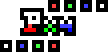
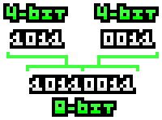

Palette-indexed 4-bit image format.

## 📄 File structure

<table>
  <thead>
    <tr>
      <th>Offset (Bytes)</th>
      <th>Size (Bytes)</th>
      <th>Description</th>
    </tr>
  </thead>
  <tbody>
    <tr>
      <td>0</td>
      <td>3</td>
      <td>The identity of "PX4".</td>
    </tr>
    <tr>
      <td>3</td>
      <td>1</td>
      <td>Image width; The maximum width is 255.</td>
    </tr>
    <tr>
      <td>4</td>
      <td>1</td>
      <td>Image height; The maximum height is 255.</td>
    </tr>
    <tr>
      <td>5</td>
      <td>~</td>
      <td>Image data; Compressed with LZW algorithm.</td>
    </tr>
  </tbody>
</table>

### 4-bit per index

Each index is represented by a 4-bit value, allowing a palette of 16 colors.\
To optimize storage, two 4-bit values are packed into a single byte, making the file 2x smaller.

> **Curiosity**: A 4-bit value is called 'nibble'.

### Lempel-Ziv-Welch 

...
